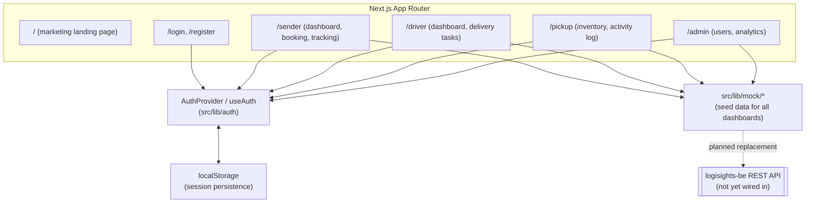

# Architecture

How this frontend fits together internally, and how it is meant to integrate with [logisights-be](https://github.com/LogiSights/logisights-be).

## Component map

## Current state versus planned integration

This frontend is presently a self-contained, fully mocked prototype:

- **Auth is fake.** `AuthProvider` (`src/lib/auth/auth-context.tsx`) simulates a login delay, writes a hardcoded demo user to `localStorage`, and never calls a real API. There is no `app/api/` layer and no HTTP client in `package.json`.
- **All dashboard data comes from `src/lib/mock/*`**, static in-memory arrays shaped to match `src/types/models.ts`.
- **Parcel pricing** (`src/lib/sender/schemas.ts`) is computed client-side for the booking wizard preview. The backend's `PricingService` is the server-authoritative version of the same formula and is what should be trusted once integration happens.

When `logisights-be` is wired in, the integration points are:

1. Replace `AuthProvider`'s fake `login`/`register` with calls to `POST /auth/login` and `POST /auth/register`, storing the returned JWT instead of a fake user object.
2. Replace each `src/lib/mock/*` module's static exports with fetches against the corresponding backend resource (`/parcels`, `/driver/tasks`, `/pickup/inventory`, `/admin/*`).
3. Role-based route gating (`src/lib/auth/roles.ts`) stays as UI-level routing convenience; the backend's `@RolesAllowed` checks remain the actual authorization boundary, so nothing here should be treated as a security control.

## Roles

| Role   | Route      |
|--------|------------|
| Sender | `/sender`  |
| Driver | `/driver`  |
| Pickup | `/pickup`  |
| Admin  | `/admin`   |

Dashboard routes are gated by role, with the mapping defined in `src/lib/auth/roles.ts`.
